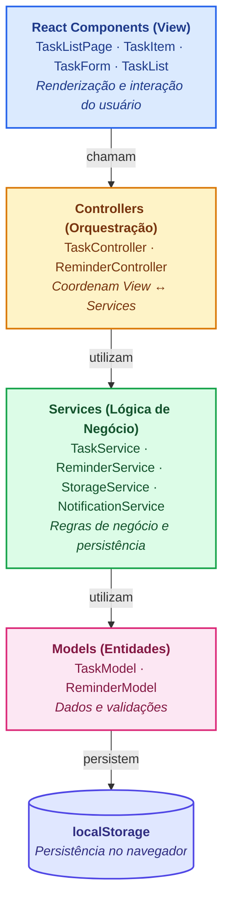
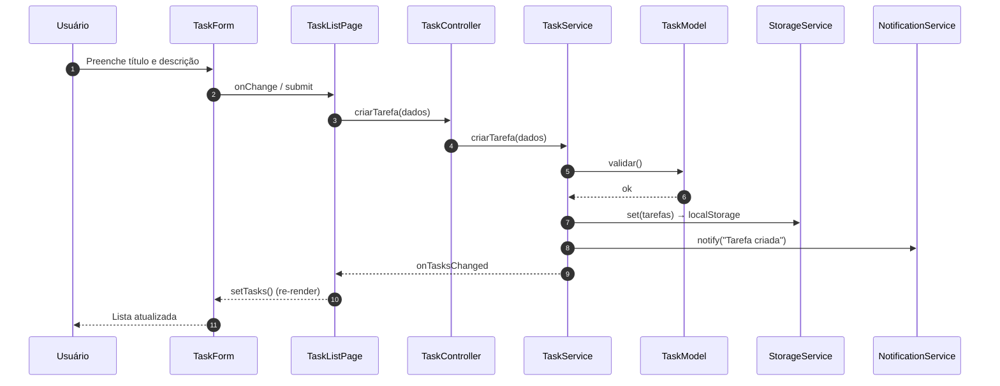
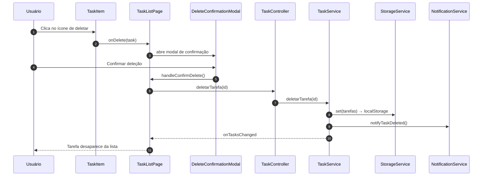
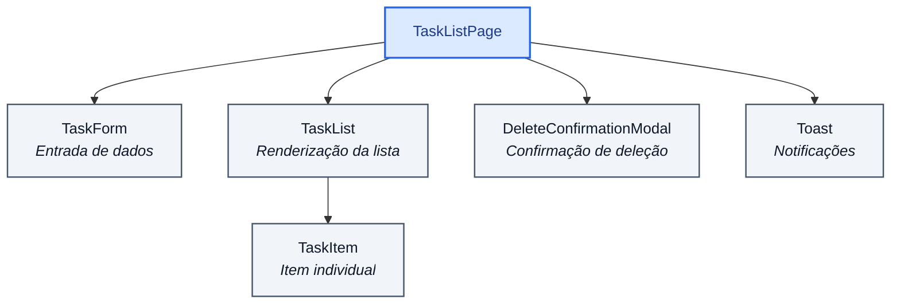

# 🏗️ Arquitetura

Visão geral da arquitetura da aplicação TODO List.

## 📐 Padrão MVC

A aplicação segue o padrão **Model-View-Controller** com uma camada extra de Services entre Controllers e Models:



## 📁 Estrutura de Diretórios

```
todo-list-sdd/
├── src/
│   ├── components/           # Componentes React (View)
│   │   ├── TaskListPage.tsx
│   │   ├── TaskList.tsx
│   │   ├── TaskItem.tsx
│   │   ├── TaskForm.tsx
│   │   ├── DeleteConfirmationModal.tsx
│   │   ├── Toast.tsx
│   │   └── *.css
│   │
│   ├── controllers/          # Controladores (Orquestração)
│   │   └── TaskController.ts
│   │
│   ├── services/             # Serviços (Lógica de Negócio)
│   │   ├── TaskService.ts
│   │   ├── ReminderService.ts
│   │   ├── StorageService.ts
│   │   ├── NotificationService.ts
│   │   ├── ValidationService.ts
│   │   └── DateService.ts
│   │
│   ├── models/               # Modelos (Entidades)
│   │   ├── Task.ts
│   │   └── Reminder.ts
│   │
│   ├── types/                # TypeScript Interfaces
│   │   ├── Task.ts
│   │   └── Reminder.ts
│   │
│   ├── constants/            # Constantes e Configurações
│   │   ├── messages.ts       # Mensagens pt-BR
│   │   └── config.ts         # Configurações da app
│   │
│   ├── utils/                # Utilitários
│   │   ├── dateUtils.ts
│   │   └── stringUtils.ts
│   │
│   ├── App.tsx               # Componente raiz
│   ├── main.tsx              # Entrada React
│   └── index.css             # Estilos globais
│
├── tests/
│   ├── unit/                 # Testes Unitários
│   │   ├── models/
│   │   ├── services/
│   │   └── utils/
│   │
│   ├── integration/          # Testes de Integração
│   │   └── task-flow.test.ts
│   │
│   └── e2e/                  # Testes E2E (Playwright)
│       └── task-management.spec.ts
│
├── docs/                     # Documentação
├── .github/
│   └── workflows/            # CI/CD
│       ├── test.yml
│       └── deploy.yml
│
├── public/                   # Arquivos estáticos
├── dist/                     # Build de produção
│
├── index.html                # HTML entry point
├── package.json              # Dependências
├── tsconfig.json             # Configuração TypeScript
├── vite.config.ts            # Configuração Vite
├── mkdocs.yml                # Documentação MkDocs
└── README.md                 # Documentação principal
```

## 🔄 Fluxo de Dados

### Criação de Tarefa



### Deleção de Tarefa



## 🔌 Integração de Componentes

### TaskListPage (Container Principal)



## 💾 Persistência

- **Armazenamento:** localStorage (browser API)
- **Prefixo:** `todo-list-`
- **Chaves:** `tasks`, `reminders`, etc.
- **Formato:** JSON serializado
- **Limite:** ~5-10 MB por domínio (varia por navegador)

### Exemplo de Dados Persistidos

```json
{
  "todo-list-tasks": [
    {
      "id": "abc123...",
      "titulo": "Estudar React",
      "descricao": "Componentes, hooks e state",
      "status": "pendente",
      "criada_em": "2026-05-10T21:29:42.657Z"
    }
  ]
}
```

## 🔐 Segurança

- ✅ **XSS Prevention:** Sanitização de inputs
- ✅ **Input Validation:** Validação rigorosa de tipos (TypeScript)
- ✅ **No Backend Exposure:** Dados apenas no cliente
- ⚠️ **localStorage:** Não use dados sensíveis (senhas, tokens)

## 📈 Performance

- **Bundle Size:** ~50 KB gzipped
- **Build Time:** ~1 segundo
- **Load Time:** < 2 segundos (com cache)
- **FCP (First Contentful Paint):** ~600ms

## 🚀 Escalabilidade Futura

### Possíveis Evoluções:

1. **Backend API**
   - Express/Node.js ou serverless
   - Sincronização em tempo real
   - Multi-device sync

2. **Database**
   - PostgreSQL/MongoDB
   - Backup automático
   - Histórico de versões

3. **Autenticação**
   - Login com email/senha
   - OAuth (Google, GitHub)
   - Autosync entre dispositivos

4. **Features Avançadas**
   - Colaboração em tempo real
   - Lembretes por SMS/Email
   - Integração com calendário
   - Mobile app (PWA/Native)

---

Para mais detalhes, consulte a [🔧 Estrutura do Projeto](../development/project-structure.md).
