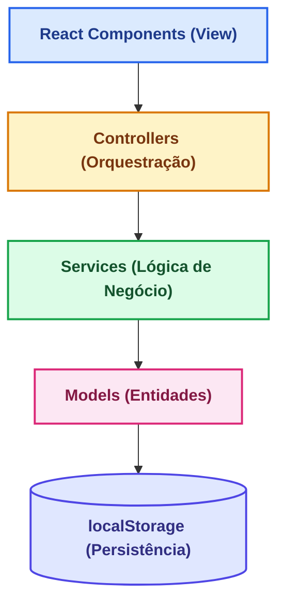

# 📝 TODO List - Gerenciador de Tarefas

Bem-vindo ao **TODO List**, uma aplicação web moderna de gerenciamento de tarefas desenvolvida seguindo a metodologia de **Especificação de Design de Software (SDD)**.

## ✨ Características

- ✅ **Gerenciamento Completo de Tarefas** - Criar, listar, marcar como concluída e deletar tarefas
- ⏰ **Sistema de Lembretes** - Configure lembretes para suas tarefas com notificações em tempo real
- 🎨 **Interface Responsiva** - Design moderno e adaptativo para todos os dispositivos
- 🌐 **100% em Português Brasileiro** - Toda a interface localizada em pt-BR
- 💾 **Armazenamento Local** - Seus dados são salvos no navegador (localStorage)
- 📦 **Sem Dependências de Backend** - Aplicação totalmente standalone, sem servidor necessário
- ⚡ **Performance Otimizada** - Build minificado (~50KB gzipped)
- 🚀 **Pronta para Deploy** - Deploy imediato no Vercel ou GitHub Pages

## 🚀 Início Rápido

### Instalação Local

```bash
# Clone o repositório
git clone https://github.com/seu-usuario/todo-list-sdd.git
cd todo-list-sdd

# Instale as dependências
npm install

# Inicie o servidor de desenvolvimento
npm run dev
```

Acesse `http://localhost:3001` no seu navegador.

### Deploy Imediato

**GitHub Pages:**
```bash
npm run build
git add dist/
git commit -m "Deploy"
git push origin main
```

**Vercel:**
- Acesse [vercel.com](https://vercel.com)
- Importe seu repositório
- Deploy automático!

## 🏗️ Arquitetura

Aplicação desenvolvida com **padrão MVC** em React + TypeScript:



Detalhes completos em [📖 Arquitetura](documentation/architecture.md).

## 🛠️ Stack Tecnológico

- **Frontend:** React 18.2 + TypeScript 5.3
- **Build:** Vite 5.0
- **Styling:** CSS moderno + Responsive Design
- **Testes:** Vitest 1.1 + Playwright 1.40
- **Deployment:** GitHub Pages + Vercel
- **Localization:** pt-BR (100%)

## 📱 Funcionalidades

### Gerenciamento de Tarefas
- Criar tarefas com título e descrição
- Listar todas as tarefas
- Marcar como concluída/pendente
- Deletar com confirmação
- Filtrar por status (todas, pendentes, concluídas)

### Infraestrutura e Qualidade
- Estrutura modular em camadas (MVC + Services)
- TypeScript em modo estrito
- Testes unitários (Vitest) e E2E (Playwright)
- CI/CD com GitHub Actions
- Deploy automatizado (GitHub Pages e Vercel)

### Fundações Técnicas
- Modelos de dados (Task, Reminder)
- Serviços de persistência (localStorage)
- Validações e sanitização (prevenção de XSS)
- Utilitários de data com locale pt-BR

## 🔗 Links Úteis

- [📖 Documentação Completa](documentation/architecture.md)
- [🚀 Deploy no GitHub Pages](deployment/github-pages.md)
- [🔧 Setup Local](development/setup.md)
- [❓ Dúvidas Frequentes](faq.md)

## 📝 Licença

Este projeto é fornecido como material educacional para demonstração da metodologia SDD.

---

**Desenvolvido com ❤️ usando SDD (Software Design Documentation)**
